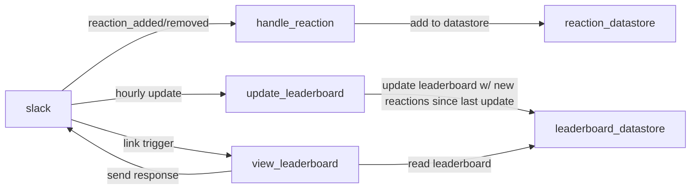

# Emoji Contest Slack App

## Summary

This app records which emoji reactions are used in your Slack workspace, and
generates a leaderboard of the most-used reactions. It uses
[Slack's new modular API](https://api.slack.com/future).

### Slack Next Gen Platform Overview

Slack's new platform provides a serverless environment to run logic in
_functions_ from _triggers_ originating in a Slack workspace.

Triggers can be manual, such as a
[link trigger](https://api.slack.com/future/triggers/link). They also can be
passive, and registered when certain things happen in the channel. Those things
are called [events](https://api.slack.com/future/triggers/event) using Slack's
platform terminology.

Slack also provides a [datastore](https://api.slack.com/future/datastores)
feature that can be used for storing simple information.

## App Overview

The `reaction_added` and `reaction_removed` events in Slack send data to the
`reaction_datastore` recording the event. Another datastore,
`leaderboard_datastore`, is updated at hourly intervals with the latest reaction
events since the last update. (Hourly intervals are the smallest increment the
API supports right now, though ideally it would be more frequent.) When users
call the `view_leaderboard` link trigger in a public channel, a message is
posted in the channel with the current leaderboard.



## Datastores

- `reaction_datastore` Info about emoji reaction events including:

  - Emoji used
  - Whether emoji was added or removed
  - Timestamp

- `leaderboard_datastore`
  - Array of most used emojis, with count
  - Timestamp of last update

## Functions

- `handle_reaction`

  - Triggers: `reaction_added`, `reaction_removed`
  - Action: adds reaction event data to `reaction_datastore`

- `view_leaderboard`

  - Triggers: link trigger
  - Action: reads `leaderboard_datastore` and sends a message with leaderboard
    data to the channel that called the link trigger

- `update_leaderboard`

  - Triggers: hourly scheduled update
  - Action: queries `reaction_datastore` for all events since last update, then
    updates `leaderboard_datastore` with these events

  ```mermaid
  sequenceDiagram
  update_leaderboard->>leaderboard_datastore: getLastUpdated
  leaderboard_datastore-->>update_leaderboard: last_updated_timestamp
  update_leaderboard->>reaction_datastore: getReactionsSince
  reaction_datastore-->>update_leaderboard: latest reactions
  update_leaderboard->>leaderboard_datastore: getLeaderboardData
  leaderboard_datastore-->>update_leaderboard: leaderboard data
  update_leaderboard->>leaderboard_datastore: saveLeaderboard
  ```
