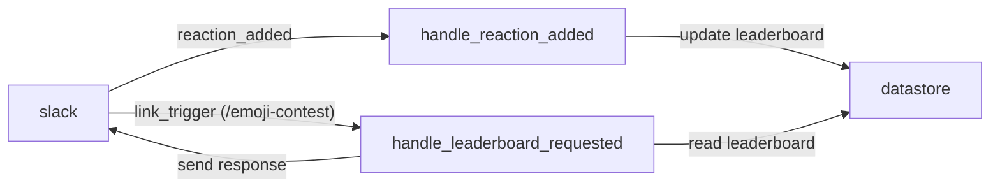

# Emoji Contest - High Level Design

## Background

- We internally hold an emoji of the week contest every week, based on whatever we think is best
- We also manually update a leaderboard w/ upload count
- We would like to move this into a bot, which keeps track of this stuff automatically, and display a basic leaderboard

## Requirements

- Listen to a single channel for an event that triggers when a reaction is added to a post
- When the app is installed in the workspace, running the command `/emoji-contest` displays a leaderboard of the top used emojis in the channel

## Assumptions

- You can format the output however you want for now (list, table, etc)
- The next-gen Slack platform should be used [here](https://api.slack.com/future)
- Store any data in a Slack [datastore](https://api.slack.com/future/datastores)
- Only a single channel needs to be supported for now
- The NW Computing Sandbox Slack should work for you develop the app
  - You should not need to pay for anything. If you do, let me know and I will prioritize unblocking you!
- If this ends up working, we will probably want to keep adding to it, ideally with your help!

## Solution Overview

This is a simplified version of what you'd see on most of our projects. It contains some of the logic and technical details to help guide a successful implementation.

### Slack Next Gen Platform Overview

Slack's new platform provides a serverless environment to run logic in _functions_ from _triggers_ originating in a Slack workspace. 

Triggers can be manual, like invoking a command (`/giphy` for a concrete example). They also can be passive, and registered when certain things happen in the channel. Those things are called [events](https://api.slack.com/future/triggers/event) using Slacks platform terminology.

Slack also provides a [datastore](https://api.slack.com/future/datastores) feature that can be used for storing simple information. We would like to use this to store our emoji counts.

This repo contains a generated "hello world" example, which can be modified or overwritten completely if needed. It is mainly here as a convenience to verify the setup works.

## Functions

- `handle_reaction_added`
  - Triggers: `reaction_added`
  - Action: update the reaction count for the incoming reaction
- `handle_leaderboard_requested`
  - Triggers: link trigger for command `/emoji-contest`
  - Action: post a message into the channel with the current leaderboard of reactions, ranked by highest count first. Can keep this to top 10 for simplification.