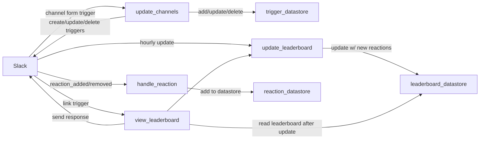
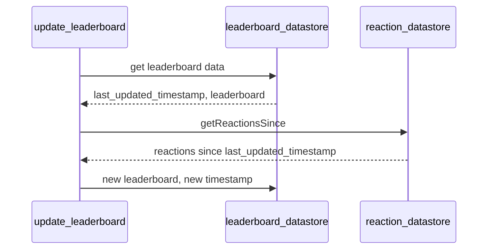
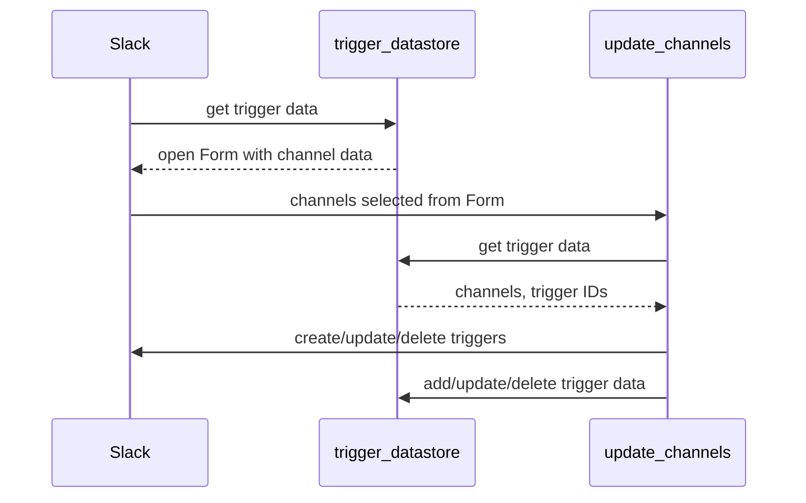

# Reaction Contest Design Doc

## Summary

This app records which emoji reactions are used in your Slack workspace, and
generates a leaderboard of the most-used reactions! It's built with
[Slack's new modular API](https://api.slack.com/future).

### Slack Next Gen Platform Overview

Slack's new platform provides a serverless environment to run logic in
_functions_ from _triggers_ originating in a Slack workspace.

Triggers can be manual, such as a
[link trigger](https://api.slack.com/future/triggers/link). They also can be
passive, and register when certain things happen in the channel. Those things
are called [events](https://api.slack.com/future/triggers/event) using Slack's
platform terminology.

Slack also provides a [datastore](https://api.slack.com/future/datastores)
feature that can be used for storing simple information.

## App Overview

`update_channels_form_trigger` opens a form to choose which channels in your
workspace will listen for reaction events. Submitting the form creates, updates,
or deletes triggers for
reaction_added`and`reaction_removed`events. Those events send data to`reaction_datastore`.

`view_leaderboard_link_trigger` updates `leaderboard_datastore` with the latest
data from `reaction_datastore` and sends a message with the updated top ten
most-used emoji reactions.

For good measure, `leaderboard_datastore` is also updated hourly with the
recurring scheduled `update_leaderboard_trigger`.

## Datastores

- `reaction_datastore` Info about emoji reaction events including:

  - Emoji used
  - Whether emoji was added or removed
  - Timestamp

- `leaderboard_datastore`

  - Array of most used emojis, with count
  - Timestamp of last update

- `trigger_datastore`
  - Array of slack channels to listen to
  - `reaction_added` trigger ID
  - `reaction_removed` trigger ID

## Functions

- `handle_reaction`

  - Triggers: `reaction_added`, `reaction_removed` events
  - Action: adds reaction event data to `reaction_datastore`

- `update_channels`

  - Triggers: `update_channels_form_trigger` link trigger
  - Action: uses form data to create, update, or delete `reaction_added` and
    `reaction_removed` event triggers, and stores data in `trigger_datastore`
  - Logic:
    - Trigger data is NOT in `trigger_datastore` AND user submitted channels
      with Form:
      - Create triggers and add data to `trigger_datastore`
    - Trigger data IS in `trigger_datastore` AND user submitted channels with
      Form:
      - Update existing triggers with new channels and update datastore
    - Trigger data IS in `trigger_datastore` AND user submitted empty Form:
      - Delete triggers and clear `trigger_datastore`

- `view_leaderboard`

  - Triggers: `view_leaderboard_trigger` link trigger
  - Action: runs `update_leaderboard`, then reads `leaderboard_datastore` and
    sends a message with leaderboard data to the channel that called the link
    trigger

- `update_leaderboard`

  - Triggers: hourly scheduled update, `view_leaderboard_trigger`link trigger
  - Action: queries `reaction_datastore` for all events since last update, then
    updates `leaderboard_datastore` with these events
  - Diagram:

## Workflows

This workflow is complex enough to warrant its own diagram.

### update_channels_workflow

Event triggers have a parameter for which channels they listen to in a Slack
workspace. `update_channels_workflow` opens a Form that allows users to modify
which channels are listening to `add_reaction` and `remove_reaction` events. The
Form opens with the current channels already populated in its selection.

